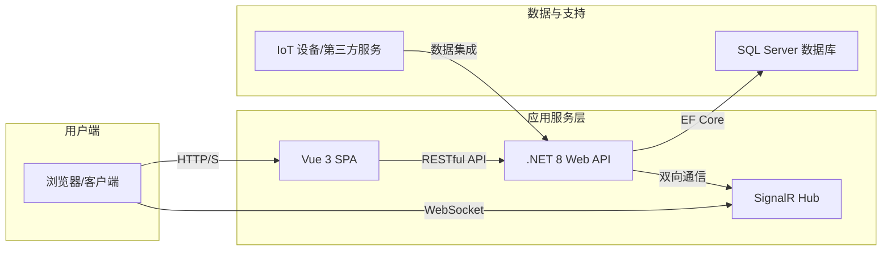

# 数字孪生智慧工地管理平台系统文档

## 1. 项目概述

本文档旨在为“数字孪生智慧工地管理平台”项目提供全面的技术和功能参考。平台基于 .NET 8 和 Vue 3 技术栈构建，通过将 BIM/3D 模型与物联网（IoT）设备数据深度融合，实现对建筑工地的全方位、多维度、实时性的监控和管理，旨在提升施工安全、优化资源配置、提高管理效率。

---

## 2. 技术架构

### 2.1. 总体架构

平台采用前后端分离的现代 Web 应用架构。

- **前端 (Frontend)**: 基于 Vue 3 的单页面应用 (SPA)，负责用户界面展示和交互。
- **后端 (Backend)**: 基于 .NET 8 的 Web API 服务，负责业务逻辑处理、数据存储和接口提供。
- **数据库 (Database)**: 使用 Microsoft SQL Server 作为主数据存储。
- **实时通信**: 通过 SignalR 实现后端与前端之间的数据实时推送。

### 2.2. 后端技术栈 (`SmartConstruction.Service`)

| 技术 | 用途 | 版本/说明 |
| --- | --- | --- |
| **核心框架** | `Microsoft.NET.Sdk.Web` | `net8.0` |
| **数据库访问** | `Entity Framework Core` | `8.0.0`, ORM 框架, Code-First |
| **数据库驱动** | `Microsoft.EntityFrameworkCore.SqlServer` | `8.0.0`, SQL Server |
| **API 框架** | `ASP.NET Core` | - |
| **身份认证** | `JWT Bearer` | `8.0.0`, Token-based Authentication |
| **实时通信** | `Microsoft.AspNetCore.SignalR` | 用于实时数据推送，如IoT数据 |
| **日志记录** | `Serilog` | `9.0.0`, 结构化日志框架 |
| **API 文档** | `Swashbuckle.AspNetCore` | `8.1.0`, 自动生成 Swagger/OpenAPI 文档 |
| **对象映射** | `AutoMapper` | `12.0.1`, DTO 与实体之间的自动转换 |
| **数据验证** | `FluentValidation.AspNetCore` | `11.3.1`, 服务端模型验证 |

### 2.3. 前端技术栈 (`SmartConstruction.Web`)

| 技术 | 用途 | 版本/说明 |
| --- | --- | --- |
| **核心框架** | `Vue.js` | `3.3.11`, 响应式前端框架 |
| **构建工具** | `Vite` | `5.0.7`, 高性能前端构建工具 |
| **编程语言**| `TypeScript` | `5.4.0`, 提供静态类型检查 |
| **UI 组件库** | `Element Plus` | `2.4.4`, 企业级 UI 组件库 |
| **路由管理** | `Vue Router` | `4.2.5`, 官方路由管理器 |
| **状态管理** | `Pinia` | `2.1.7`, 新一代状态管理库 |
| **HTTP 请求** | `Axios` | `1.6.2`, Promise-based HTTP 客户端 |
| **3D 渲染** | `Three.js` | `0.178.0`, 用于数字孪生场景的 3D 模型渲染 |
| **数据图表** | `ECharts` | `5.4.3`, 可视化图表库 |
| **CSS 预处理器**| `Sass` | `1.69.5`, CSS 扩展语言 |
| **国际化** | `vue-i18n` | `11.1.10`, 多语言支持 |

---

## 3. 功能模块

系统功能主要围绕项目管理、人员管理、设备管理、安全管理以及核心的数字孪生可视化模块进行构建。

| 一级模块 | 二级模块 | 主要功能描述 | 对应后端 Controller | 对应前端 View |
| --- | --- | --- | --- | --- |
| **系统管理** | 租户管理 | 管理系统内的租户信息。 | `TenantController` | `tenant/` |
| | 公司管理 | 管理租户下的公司实体。 | `CompanyController` | `company/` |
| | 组织架构 | 维护公司内部的部门/组织结构。 | `OrganizationController` | `organization/` |
| | 用户管理 | 系统用户账户的创建、编辑、状态管理。 | `UserController` | `system/user/` |
| | 角色与权限 | 基于角色的访问控制(RBAC)，管理角色及菜单权限。 | `RoleController`, `PermissionController` | `system/role/` |
| | 菜单管理 | 动态配置系统导航菜单。 | `MenuController` | `system/menu/` |
| | 系统日志 | 查看系统操作日志和审计日志。 | `AuditLogController` | - |
| | 元数据管理 | 系统元数据和实体的动态注册与管理。 | `MetadataController`, `EntityRegistryController` | `metadata/` |
| **项目核心** | 项目管理 | 创建和管理建筑项目信息。 | `ProjectController` | `project/` |
| | 班组管理 | 管理项目下的施工班组。 | `TeamController` | `team/` |
| | 工人管理 | 维护工人档案、合同、资质等信息。 | `WorkerController` | `worker/` |
| **现场管理** | 考勤管理 | 工人进出场打卡记录和考勤统计。 | `AttendanceController` | `attendance/` |
| | 设备管理 | 录入和监控现场设备（如塔吊、摄像头）状态。 | `DeviceController` | `device/` |
| | 安全管理 | 记录和追踪安全事件、安全培训。 | `SafetyIncidentController` | `safety/` |
| **数字孪生** | 指挥中心 | 3D 可视化大屏，集成各类监控数据。 | `DigitalTwinController` | `digital-twin/command-center` |
| | 实时监控 | 在 3D 场景中实时展示设备、人员位置和状态。 | `IntegrationController` | `digital-twin/monitoring` |
| | 智能分析 | 基于采集的数据进行分析预警。 | `DigitalTwinApiController` | - |
| **仪表盘** | 数据看板 | 聚合展示项目关键指标(KPI)。 | `DashboardController` | `dashboard/` |
| **开发者工具** | 接口调试 | 提供用于开发和测试的API端点。 | `DevToolsController`, `TestController` | - |

---

## 4. 系统特点

1.  **多租户架构**: 系统在设计上支持多租户，`Tenant` 实体为顶层数据隔离单元，确保不同租户间的数据安全。
2.  **动态权限控制 (RBAC)**: 基于“用户-角色-菜单/权限”模型，可灵活配置不同角色的操作权限和可见菜单，权限控制可细化到 API 接口层面。
3.  **数字孪生可视化**: 核心亮点功能。通过 `Three.js` 加载和渲染 3D 模型，并结合从 `SignalR` 推送的实时 IoT 数据，实现对工地的虚拟映射和实时监控。
4.  **数据驱动**: 系统内大量数据实体如 `Project`, `Worker`, `Device`, `AttendanceRecord` 等构成了数据驱动决策的基础。
5.  **配置化与可扩展性**: `Metadata`, `EntityRegistry`, `UIComponent`, `UILayout` 等实体的存在，表明系统具备高度的配置化能力和面向低代码方向的扩展潜力。

---

## 5. 接口清单 (部分)

以下为后端核心 `Controller` 及其职责概述，详细接口定义请参考 `/swagger` 路径下的 OpenAPI 文档。

- **`AuthController`**: 处理用户登录、登出、Token 刷新。
- **`DigitalTwinController`**: 提供数字孪生大屏所需的各类聚合数据接口。
- **`DashboardController`**: 提供仪表盘所需的统计数据。
- **`*Controller` (e.g., `ProjectController`, `WorkerController`..)**: 提供对相应资源的增删改查 (CRUD) 标准接口。
- **`InitializationController`**: 提供手动触发数据库初始化的接口。
- **`MenuController`**: 提供获取用户授权菜单的接口。
- **`IntegrationController`**: 接收和处理来自 IoT 设备的数据。

---

## 6. 核心数据模型

以下为系统中最核心的一部分数据实体：

- **`BaseEntity`**: 所有实体的基类，包含 `Id`, `CreatedAt`, `UpdatedAt`, `IsDeleted` 等公共字段。
- **`Tenant`**: 租户实体，系统的最高组织单位。
- **`User`**: 系统用户。
- **`Role`**: 角色，权限的集合。
- **`Menu`**: 系统菜单项，与前端路由关联。
- **`Permission`**: 权限点，通常关联到具体的后端 API。
- **`Project`**: 建筑项目。
- **`Worker`**: 工人。
- **`Device`**: 现场设备（塔吊、传感器等）。
- **`AttendanceRecord`**: 考勤记录。
- **`SafetyIncident`**: 安全事件记录。
- **`RefreshToken`**: 用于实现 JWT 无感刷新的 Refresh Token。

---

## 7. 部署说明

### 7.1. 后端部署

1.  确保服务器已安装 .NET 8.0 SDK/Runtime。
2.  在 `appsettings.json` 中配置正确的数据库连接字符串。
3.  在 `src/SmartConstruction.Service/` 目录下执行 `dotnet publish -c Release` 命令进行发布。
4.  将 `publish` 目录下的所有文件部署到服务器（如 IIS, Docker 容器）。
5.  运行 `SmartConstruction.Service.exe` 或通过 IIS 启动应用池。

### 7.2. 前端部署

1.  确保服务器已安装 Node.js。
2.  在 `src/SmartConstruction.Web/` 目录下执行 `npm install` 安装依赖。
3.  修改 `.env.production` 文件，将 `VITE_API_BASE_URL` 指向后端服务的地址。
4.  执行 `npm run build` 命令进行打包。
5.  将 `dist` 目录下的所有文件部署到 Web 服务器（如 Nginx, Apache）。
6.  配置 Nginx/Apache 将所有请求重定向到 `index.html`，以支持 Vue Router 的 history 模式。

---

## 8. 性能与扩展

- **性能优化**:
  - **后端**: 系统预留了 `QueryOptimization` 和 `CacheStrategy` 实体，可用于实现数据库查询优化和缓存策略。
  - **前端**: 使用了 `Vite` 进行快速构建，并通过 `unplugin-auto-import` 和 `unplugin-vue-components` 实现组件和 API 的按需自动导入。打包时可通过 `vite-plugin-compression` 生成 Gzip/Brotli 压缩文件。
- **功能扩展**:
  - **新业务模块**: 可通过创建新的 `Entity`, `Controller`, `Service` (后端) 和 `views` (前端) 来快速添加新的业务模块。
  - **低代码扩展**: `EntityRegistry`, `UILayout`, `UIComponent` 等设计为系统的低代码扩展能力提供了基础，未来可开发动态表单、动态页面的功能。

---

## 9. 技术支持

*本文档由 Gemini 智能助理根据项目源码自动分析生成。* 